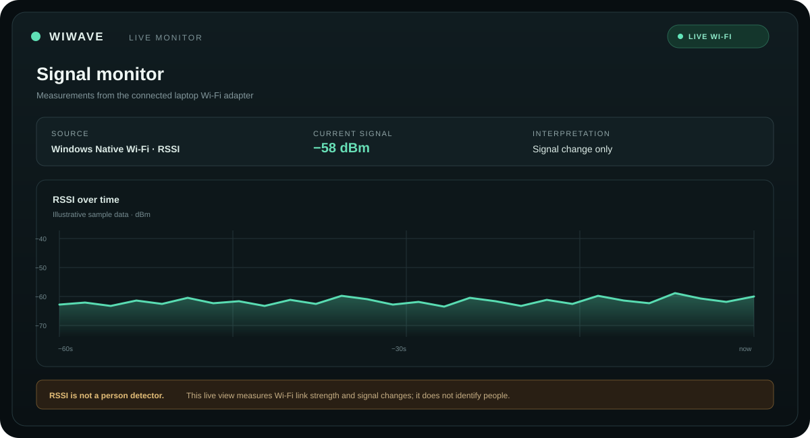
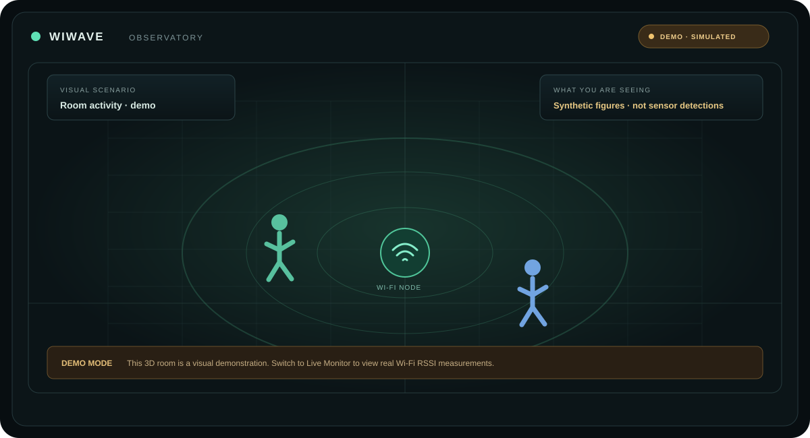

# WiWave Motion

**A local Wi-Fi signal monitoring workspace with an interactive 3D Observatory and an optional CSI research workflow.**

WiWave currently reads the connected Windows Wi-Fi adapter's RSSI (received signal strength) and reports changes against a quiet-room baseline. RSSI is not radar: it cannot reliably tell whether a person caused a change, count people, locate them, or identify objects. The 3D Observatory is a visualization; its people and scenarios are synthetic.

## Demo gallery

These original illustrations show the two main views. They are illustrative previews, not screenshots or sensor output. The Observatory figures are simulated.

| Live Monitor | Observatory demo |
| --- | --- |
|  |  |
| Real link-strength readings from the local adapter; changes are not human detections. | Synthetic room scene for exploring the interface; figures are not detections. |

## Run on Windows

Requirements: Python 3.10 or newer, Node.js compatible with the bundled Vite version, and an active Wi-Fi connection.

```powershell
python -m venv .venv # Skip if the virtual environment already exists
.\.venv\Scripts\python.exe -m pip install -r requirements.txt
Push-Location frontend
npm ci
npm run build
Pop-Location
.\scripts\start-live.ps1
```

Open **http://127.0.0.1:8000** and check for the **LIVE WI-FI** badge. Leave the laptop and room undisturbed during the initial 20-second calibration. **Workspace → Operations** contains calibration and recording controls; **Live Monitor** opens the detailed charts at `/monitor.html`.

For frontend development, keep the backend running and use `npm run dev` in `frontend`. To run the backend directly, set `WIWAVE_SOURCE=native_rssi` and `SIMULATION_MODE=false`, then run `python server.py` from the project root.

## What works today

- Live Windows Native WLAN RSSI readings with explicit sensor health and source status.
- Quiet-baseline calibration and sustained signal-change reporting.
- Live monitor charts, activity log, local recording, CSV export, and replay.
- Interactive RuView-derived 3D Observatory with visual settings and demo scenarios.
- Optional labelled CSI amplitude capture from Espressif serial CSV, stored locally and exportable as JSON Lines.
- Optional adapter for compatible estimates from a separately running RuView sensing service.
- Bounded WebSocket updates and HTTP polling fallback.

There is no trained or locally validated people-detection model in this release. Historical modules under `multi_person/` and `motion_detector.py` are not part of the live detection path. Demo figures and scenes do not come from the sensor. The signal-change score is a statistic, not a detection-confidence percentage; the reported read rate is driver polling, not necessarily the radio's independent refresh rate.

## Optional CSI research setup

CSI (Channel State Information) provides richer wireless-channel measurements than laptop RSSI. It requires a compatible, programmed CSI receiver; the built-in Intel AC8265 adapter does not supply CSI to this application. WiWave's current Espressif serial parser accepts CSI CSV output. The capture workflow is for collecting room data, not a ready-made people detector.

1. Follow Espressif's official [`esp-csi` project](https://github.com/espressif/esp-csi) and [`csi_recv_router` setup](https://github.com/espressif/esp-csi/tree/master/examples/get-started/csi_recv_router) to configure a supported board and Wi-Fi link.
2. Install the optional reader dependency with `python -m pip install -r requirements-csi.txt`.
3. Connect the receiver over USB. On Windows, start it with `scripts/start-csi.ps1` (use `-Port COM3` if port detection needs help).
4. In the app, open **Workspace → CSI data** to start a labelled trial, stop it, and export the resulting JSONL locally.
5. Collect multiple labelled room sessions, then train and evaluate a task-specific model on held-out sessions before treating any output as a people-detection result.

CSI trials remain in the local SQLite database until exported. Capture starts only when explicitly requested in the UI. Review the [live sensing guide](docs/LIVE_SENSING_GUIDE.md) for setup and room-trial details.

## API

| Route | Purpose |
| --- | --- |
| `GET /api/health` | Service and sensor health, source, sample age, and read rate |
| `GET /api/poll` | Latest live snapshot and source capability flags |
| `WS /ws/radar` | Live snapshots, published up to 10 Hz |
| `GET /api/capabilities` | Capabilities of the selected measurement source |
| `POST /api/calibrate` | Restart quiet-room calibration |
| `POST /session/start` · `POST /session/stop` | Start or stop a local recording |
| `GET /sessions` | Recent recording sessions |
| `GET /session/{id}/export` | Export a recording as CSV |
| `GET /session/{id}/frames?limit=10000` | Bounded recording frames for replay |
| `GET /api/csi/trials` | List labelled CSI trials |
| `POST /api/csi/trials/start` · `POST /api/csi/trials/stop` | Start or stop an explicitly requested CSI trial |
| `POST /api/csi/trials/label` | Change the label for subsequent CSI frames |
| `GET /api/csi/trials/{id}/export` | Export trial frames as JSON Lines |
| `DELETE /api/csi/trials/{id}` | Delete one trial and its local samples |

## Project notes

- [Current status and remaining work](docs/PROJECT_STATUS.md)
- [Live sensing and room-trial guide](docs/LIVE_SENSING_GUIDE.md)
- [RuView feature comparison](docs/RUVIEW_PARITY.md)
- [Research datasets and model integration](docs/DATASETS_AND_MODELS.md)
- [Real-time sensing research](docs/REALTIME_RESEARCH.md)
- [RuView code license and provenance](frontend/observatory/PROVENANCE.md)

Cloud hosting cannot read the Wi-Fi adapter attached to your laptop. `render.yaml` runs a labelled demo. Local recordings are ignored by Git; source code and documentation are published to the repository.
